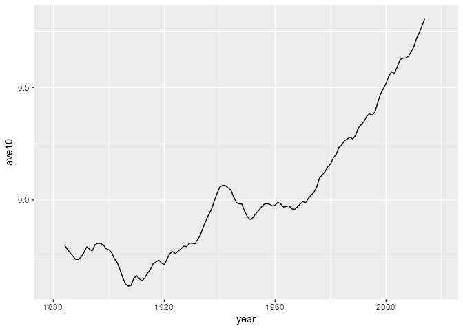
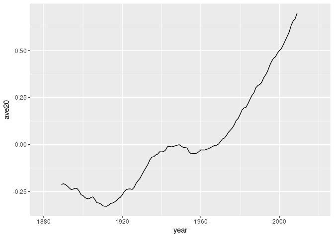

Climate Exercise
================
Joslyn Fu & Kelly Yuan

**This is a climate change excerise by Joslyn and Jiaming to dive into
how the main indicators of climate change, including C02 trends, global
temperature change.**

-----

# CO2 Trends

First, we exmaine the CO2 trends.

## Dataset Description

This is from the [NASA Climate Change
Section](http://climate.nasa.gov/vital-signs/carbon-dioxide/), and the
original data is obtained from the National Oceanic and Atmospheric
Administration, specifically the Earth System Research Laboratories.

The Data is shown below:

``` r
library(tidyverse)
```

``` r
co2 <- 
read_table("https://raw.githubusercontent.com/espm-157/climate-template/master/assignment/co2_mm_mlo.txt", 
                  comment="#",
                  col_names = c("year", "month", "decimal_date", "average",
                                "interpolated", "trend", "days"),
                  na = c("-1", "-99.99"))
co2
```

    ## # A tibble: 749 x 7
    ##     year month decimal_date average interpolated trend  days
    ##    <dbl> <dbl>        <dbl>   <dbl>        <dbl> <dbl> <dbl>
    ##  1  1958     3        1958.    316.         316.  315.    NA
    ##  2  1958     4        1958.    317.         317.  315.    NA
    ##  3  1958     5        1958.    318.         318.  315.    NA
    ##  4  1958     6        1958.     NA          317.  315.    NA
    ##  5  1958     7        1959.    316.         316.  315.    NA
    ##  6  1958     8        1959.    315.         315.  316.    NA
    ##  7  1958     9        1959.    313.         313.  316.    NA
    ##  8  1958    10        1959.     NA          313.  316.    NA
    ##  9  1958    11        1959.    313.         313.  315.    NA
    ## 10  1958    12        1959.    315.         315.  316.    NA
    ## # … with 739 more rows

We then visualize the data. We use the interpolated column as Y because
it will omit gaps.

``` r
ggplot(co2, aes(x = decimal_date, y = trend)) + geom_line() 
```

<!-- -->

## Trend from the Graph

According to the dataset, C02 level usually reaches its annual maximum
around May and June, and its minimum around September and Octobor. Based
on our research, much of this variation happens because of the role of
plants in the carbon cycle. Plants extract CO2 from the atmosphere,
along with sunlight and water, to make food and other substances that
they need to grow —— this is the process of *photosysthesis*. Therefore,
CO2 in the atmosphere decreases during the growing season and increases
during the rest of the year, which leads to maximum buildup in May
before photosynthesis begins to take over in the summer time.
Photosynthesis, in which plants take up CO2 from the atmosphere and
release oxygen, dominates during the growing season (the warmer part of
the year). Respiration, by which plants and animals take up oxygen and
release CO2, occurs all the time but dominates during the colder months
of the year.

In computing the “average” column, the scientists use the monthly mean
CO2 mole fraction determined from daily averages. The “interpolated”
column includes average values from the “average” column and
interpolated values where data are missing. Based on the information
given by NASA, in calculating the interpolated value, they use a 7-year
rolling avearage. Then for the “trend” line, they determine the
“trend”value for each month by removing the seasonal cycle.

-----

# Global Temperatre

After examining CO2 trend, we look into the global temperature data from
[NASA Global Climate Change
Section](http://climate.nasa.gov/vital-signs/global-temperature).

## Dataset Description

The temperature dataset contains information about gobal annual mean
temperature from 1880 to 2019 relative to 1951-1980 average
temperatures. This graph illustrates the change in global surface
temperature relative to 1951-1980 average temperatures.

Please see the below dataset table.

``` r
temperature <- read_table(
  "http://climate.nasa.gov/system/internal_resources/details/original/647_Global_Temperature_Data_File.txt",
  skip = 5,
  col_names = c("year","temp","lowess5"))
```

    ## Parsed with column specification:
    ## cols(
    ##   year = col_double(),
    ##   temp = col_double(),
    ##   lowess5 = col_double()
    ## )

``` r
temperature
```

    ## # A tibble: 140 x 3
    ##     year  temp lowess5
    ##    <dbl> <dbl>   <dbl>
    ##  1  1880 -0.16   -0.08
    ##  2  1881 -0.07   -0.12
    ##  3  1882 -0.1    -0.16
    ##  4  1883 -0.17   -0.19
    ##  5  1884 -0.28   -0.23
    ##  6  1885 -0.32   -0.25
    ##  7  1886 -0.3    -0.26
    ##  8  1887 -0.35   -0.26
    ##  9  1888 -0.16   -0.26
    ## 10  1889 -0.09   -0.25
    ## # … with 130 more rows

## Temperature Graph

This is the trend in global mean temperatures over time.

``` r
temperature %>%
  ggplot(aes(x = year, y = temp)) + geom_line()
```

<!-- -->

According to the graph, the overall trend in global temperature is
increasing. Starting from 2012, the increase in global temperature is
surging at a higher rate.

## A Possible Pause?

The [2013 IPCC
Report](https://www.ipcc.ch/pdf/assessment-report/ar5/wg1/WG1AR5_SummaryVolume_FINAL.pdf)
included a tentative observation of a “much smaller increasing trend” in
global mean temperatures since 1998 than was observed previously. This
led to much discussion in the media about the existence of a “Pause” or
“Hiatus” in global warming rates, as well as much research looking
into where the extra heat could have gone. (Examples discussing this
question include articles in [The
Guardian](http://www.theguardian.com/environment/2015/jun/04/global-warming-hasnt-paused-study-finds),
[BBC News](http://www.bbc.com/news/science-environment-28870988), and
[Wikipedia](https://en.wikipedia.org/wiki/Global_warming_hiatus)).

Given the trend plotted above, there is no evidence for such a pause.
The temperature keeps rising since the early 1960s with faster pace. It
took about 40 years from 1960 to 2000 to rise from below 0 Celsius
degree to 0.5 Celsius degree; however, to rise from 0.5 to 1 Celsius
degree, it took less than 20 years. These are just rough estimates based
on the graph. If we’re given more data that focuses on the difference
among each year/decade, we can appraoch the truth of pause more
accurately.

## Exploring Rolling Averages

Let’s stop here and dive deep into the rolling averages. A 5-year
average is like a 5-year window around a specific date and the average
of those values, while the annual avearage is just the average of
tempeatures recorded for a 12-month window, starting from each year’s
January to December. Here, we add three columns to the original
temperature dataframe, representing a 5-year average, a 10-year one, and
a 20-year one, respectively. We also attach a graph for each one.

To find the rolling average, we first need to install its corresponding
package:

``` r
install.packages("RcppRoll")
```

    ## Installing package into '/usr/local/lib/R/site-library'
    ## (as 'lib' is unspecified)

``` r
library("RcppRoll")
```

And then, it’s time to draw\!

``` r
temperature %>%
  mutate(ave5 = roll_mean(temp,5,fill=NA)) %>%
  ggplot(aes(x = year, y = ave5)) + geom_line()
```

    ## Warning: Removed 4 row(s) containing missing values (geom_path).

<!-- -->

``` r
temperature %>%
  mutate(ave10 = roll_mean(temp,10,fill=NA))%>%
  ggplot(aes(x = year, y = ave10)) + geom_line()
```

    ## Warning: Removed 9 row(s) containing missing values (geom_path).

<!-- -->

``` r
temperature %>%
  mutate(ave20 = roll_mean(temp,20,fill=NA))%>%
  ggplot(aes(x = year, y = ave20)) + geom_line()
```

    ## Warning: Removed 19 row(s) containing missing values (geom_path).

<!-- -->

The differences among these three graphs are very significant due to the
different means I have on the y-axis. When we increase the time window,
the trend would generally grow flat and smooth. This is because as we
even out the temperatrue over a larger time window, the difference
between 2 time window would be smaller.

-----

# Melting Ice Sheets

The ice loss has been extremely massive over the past years. In order to
investigate this problem, we look into both **Antarctica** (green line)
and **Greenland** (blue line) mass data from 2002 [NASA Global Climate
Change Section - Ice
Sheets](https://climate.nasa.gov/vital-signs/ice-sheets/).

## Dataset Description

``` r
ice <- read_csv("http://climate.nasa.gov/system/internal_resources/details/original/499_GRN_ANT_mass_changes.csv",skip = 10,
                col_names = c("time","greenland_mass","antarctica_mass"))
```

    ## Parsed with column specification:
    ## cols(
    ##   time = col_double(),
    ##   greenland_mass = col_double(),
    ##   antarctica_mass = col_double()
    ## )

``` r
ice
```

    ## # A tibble: 140 x 3
    ##     time greenland_mass antarctica_mass
    ##    <dbl>          <dbl>           <dbl>
    ##  1 2002.          1491.            967.
    ##  2 2002.          1486.            979.
    ##  3 2003.          1287.            512.
    ##  4 2003.          1258.            859.
    ##  5 2003.          1257.            694.
    ##  6 2003.          1288.            592.
    ##  7 2003.          1337.            658.
    ##  8 2003.          1354.            477.
    ##  9 2003.          1363.            546.
    ## 10 2003.          1427.            494.
    ## # … with 130 more rows

There are three columns in the table. i) ‘Time’ in units of ‘year-day’
ii) ‘greenland\_mass’ in units of ‘Gt’ iii) ‘antarctica\_mass’ in units
of ‘Gt’

The numbers are from Ice mass measurement by NASA’s GRACE satellites.
The uncertainty depends on the accuracy of the satellites. The missing
values indicate a gap between missions during that time (from June 2017
to June 2018).

## Ice Graph for Both Two Masses

``` r
ice %>%
  ggplot(aes(x = time)) + 
  geom_line(aes(y = greenland_mass), col="blue") +
  geom_line(aes(y = antarctica_mass), col = "red")
```

<!-- -->

The trend is that both ice mass are decreasing. In each year, there is a
wave-like shape, suggesting that there is a decrease in summer and an
increase in winter. This is due to the natural temperature variation in
different reasons. However, greenland mass is decreasing at a faster
rate than antarctica mass. While greenland mass was initially heavier
than antarctica mass, greenland mass is now less than the antarctica
mass.

-----

# Rising Sea Level

Rising sea level is another vital indicator of climate change. According
to NASA, sea level rise is caused primarily by two factors: the added
water from melting ice sheets and glaciers and the expansion of seawater
as it warms. We analyze rising sea level from the information provided
by [NASA Global Climate Change Section - Sea
Level](https://climate.nasa.gov/vital-signs/sea-level/)

## Sea Level Dataset

The data is obtained from Satellite sea level observations. We have data
from 1993 to present. We give credit to the NASA Goddard Space Flight
Center.

``` r
sea_level <- read_table("http://climate.nasa.gov/system/internal_resources/details/original/121_Global_Sea_Level_Data_File.txt",
                        skip = 50,
                        col_names = c("altimeter_type","merged_file_cycle","number_of_observations","number_of_weighted_observations",
                                      "gmsl_variation_adjustment_not_applied","standard_deviation_of_gmsl_variation_no_adjustment",
                                      "gmsl_variation_adjustment_applied","standard_deviation_of_gmsl_adjustment",
                                      "smoothed_gmsl_variation","smoothed_gmsl_variation_removed_signal"))
```

    ## Parsed with column specification:
    ## cols(
    ##   altimeter_type = col_double(),
    ##   merged_file_cycle = col_double(),
    ##   number_of_observations = col_double(),
    ##   number_of_weighted_observations = col_double(),
    ##   gmsl_variation_adjustment_not_applied = col_double(),
    ##   standard_deviation_of_gmsl_variation_no_adjustment = col_double(),
    ##   gmsl_variation_adjustment_applied = col_double(),
    ##   standard_deviation_of_gmsl_adjustment = col_double(),
    ##   smoothed_gmsl_variation = col_double(),
    ##   smoothed_gmsl_variation_removed_signal = col_double()
    ## )

``` r
sea_level
```

    ## # A tibble: 844 x 10
    ##    altimeter_type merged_file_cyc… number_of_obser… number_of_weigh…
    ##             <dbl>            <dbl>            <dbl>            <dbl>
    ##  1              0               14            1993.           419112
    ##  2              0               15            1993.           456793
    ##  3              0               16            1993.           414055
    ##  4              0               17            1993.           465235
    ##  5              0               18            1993.           463257
    ##  6              0               19            1993.           458542
    ##  7            999               20            1993.           464921
    ##  8              0               21            1993.           459017
    ##  9              0               22            1993.           467041
    ## 10              0               23            1993.           464740
    ## # … with 834 more rows, and 6 more variables:
    ## #   gmsl_variation_adjustment_not_applied <dbl>,
    ## #   standard_deviation_of_gmsl_variation_no_adjustment <dbl>,
    ## #   gmsl_variation_adjustment_applied <dbl>,
    ## #   standard_deviation_of_gmsl_adjustment <dbl>, smoothed_gmsl_variation <dbl>,
    ## #   smoothed_gmsl_variation_removed_signal <dbl>

According to the table, GMSL denotes Global Mean Sea Level. We are able
to see the variations in global mean sea levels and their standard
deviations. We make the plot below using the smoothed global mean sea
level variation and the one with removed signal.

## Sea Level Graph

``` r
sea_level %>%
  ggplot(aes(x = number_of_observations)) +
  geom_line(aes(y = smoothed_gmsl_variation),col= "blue") +
  geom_line(aes(y = smoothed_gmsl_variation_removed_signal),col= "red")
```

<!-- -->

The graph above tracks the change in sea level since 1993 as observed by
satellites. We can easily see the variation is increasing, suggesting
that the sea level is rising
    gradually.

# Arctic Sea Ice

  - <http://nsidc.org/data/G02135>
  - <ftp://sidads.colorado.edu/DATASETS/NOAA/G02135/north/daily/data/N_seaice_extent_daily_v3.0.csv>

## Question 1:

  - Describe the data set: what are the columns and units?
  - Where do these data come from?
  - What is the uncertainty in measurement? Resolution of the data?
    Interpretation of missing values?

## Question 2:

Construct the necessary R code to import this data set as a tidy `Table`
object.

``` r
library(dplyr)
library(lubridate)
```

    ## 
    ## Attaching package: 'lubridate'

    ## The following objects are masked from 'package:base':
    ## 
    ##     date, intersect, setdiff, union

``` r
sea_ice <- read_csv("https://github.com/espm-157/climate-template/releases/download/data/N_seaice_extent_daily_v3.0.csv",
                    skip = 2, col_names = c("year","month","day","extent","missing"))
```

    ## Parsed with column specification:
    ## cols(
    ##   year = col_double(),
    ##   month = col_character(),
    ##   day = col_character(),
    ##   extent = col_double(),
    ##   missing = col_double()
    ## )

    ## Warning: 13648 parsing failures.
    ## row col  expected    actual                                                                                                 file
    ##   1  -- 5 columns 6 columns 'https://github.com/espm-157/climate-template/releases/download/data/N_seaice_extent_daily_v3.0.csv'
    ##   2  -- 5 columns 6 columns 'https://github.com/espm-157/climate-template/releases/download/data/N_seaice_extent_daily_v3.0.csv'
    ##   3  -- 5 columns 6 columns 'https://github.com/espm-157/climate-template/releases/download/data/N_seaice_extent_daily_v3.0.csv'
    ##   4  -- 5 columns 6 columns 'https://github.com/espm-157/climate-template/releases/download/data/N_seaice_extent_daily_v3.0.csv'
    ##   5  -- 5 columns 6 columns 'https://github.com/espm-157/climate-template/releases/download/data/N_seaice_extent_daily_v3.0.csv'
    ## ... ... ......... ......... ....................................................................................................
    ## See problems(...) for more details.

``` r
sea_ice
```

    ## # A tibble: 13,648 x 5
    ##     year month day   extent missing
    ##    <dbl> <chr> <chr>  <dbl>   <dbl>
    ##  1  1978 10    26      10.2       0
    ##  2  1978 10    28      10.4       0
    ##  3  1978 10    30      10.6       0
    ##  4  1978 11    01      10.7       0
    ##  5  1978 11    03      10.8       0
    ##  6  1978 11    05      11.0       0
    ##  7  1978 11    07      11.1       0
    ##  8  1978 11    09      11.2       0
    ##  9  1978 11    11      11.3       0
    ## 10  1978 11    13      11.5       0
    ## # … with 13,638 more rows

``` r
avg_sea_ice <- sea_ice %>% 
  mutate(date = make_date(year, month, day)) %>%
  group_by(year(date)) %>%
  summarize(avg_extent = mean(extent, na.rm = TRUE))
```

    ## `summarise()` ungrouping output (override with `.groups` argument)

``` r
avg_sea_ice
```

    ## # A tibble: 43 x 2
    ##    `year(date)` avg_extent
    ##           <dbl>      <dbl>
    ##  1         1978       12.5
    ##  2         1979       12.3
    ##  3         1980       12.3
    ##  4         1981       12.1
    ##  5         1982       12.4
    ##  6         1983       12.3
    ##  7         1984       11.9
    ##  8         1985       12.0
    ##  9         1986       12.2
    ## 10         1987       11.4
    ## # … with 33 more rows

``` r
names(avg_sea_ice)[1] <- "year"
avg_sea_ice%>%
  ggplot(aes(x= year,y=avg_extent))+geom_line()
```

<!-- -->

## Question 3:

Plot the data and describe the trends you observe.

# Exercise V: Longer term trends in CO2 Records

The data we analyzed in the unit introduction included CO2 records
dating back only as far as the measurements at the Manua Loa
observatory. To put these values into geological perspective requires
looking back much farther than humans have been monitoring atmosopheric
CO2 levels. To do this, we need another approach.

[Ice core data](http://cdiac.ornl.gov/trends/co2/ice_core_co2.html):

Vostok Core, back to 400,000 yrs before present day

  - Description of data set:
    <http://cdiac.esd.ornl.gov/trends/co2/vostok.html>
  - Data source:
    <http://cdiac.ornl.gov/ftp/trends/co2/vostok.icecore.co2>

## Questions / Tasks:

  - Describe the data set: what are the columns and units? Where do the
    numbers come from?
  - What is the uncertainty in measurment? Resolution of the data?
    Interpretation of missing values?
  - Read in and prepare data for analysis.
  - Reverse the ordering to create a chronological record.  
  - Plot data
  - Consider various smoothing windowed averages of the data.
  - Join this series to Mauna Loa data
  - Plot joined data
  - Describe your
conclusions

<!-- end list -->

``` r
#table <- read.fwf("https://cdiac.ess-dive.lbl.gov/ftp/trends/co2/vostok.icecore.co2",
#                  sep = "\\",skip=21,col.names = c("depth","age of the ice","age of the air","co2 concentration"))
#table
```
